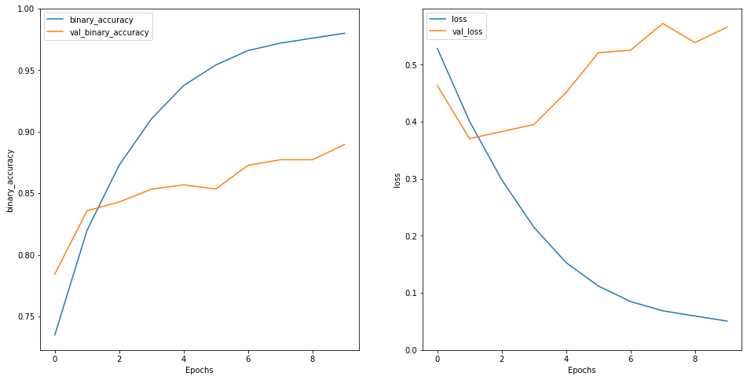
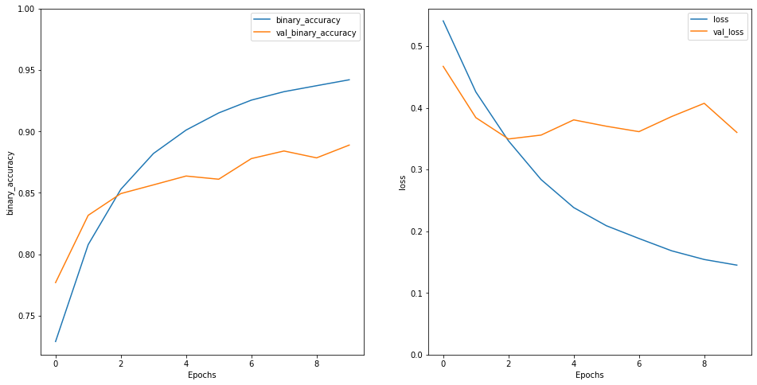

# Recomendador de películas de IMDB en base al estado de ánimo en twitter

</br>
</br>

<center>
  
</center>

<center>
  
</center>

<center>
  
</center>

</br>
</br>
</br>
</br>

## Grupo : 4ºA

## Alumno : Víctor Manuel Cavero Gracia

<div style="page-break-after: always;"></div>

# Docker

Para facilitar que todas las dependencias sean iguales en cuanto a versión y no haya problemas tanto en las importaciones como en las distintas trazas de ejecución, utilizo la herramienta Docker. 

```
FROM tensorflow/tensorflow:latest-jupyter  
RUN pip install textblob english_words tweepy sklearn wordcloud keras seaborn matplotlib pandas numpy
RUN mkdir practicaFinal
ADD .  practicaFinal/
```

En linea de comandos:

```
$ sudo docker build -t my-tf-image .

$ sudo docker run -p 8888:8888 my-tf-image
```

# Obtención de los datos

Los datos se encuentran almacenados en la carpeta data y han sido obtenidos de los siguientes recursos:

- https://www.kaggle.com/kazanova/sentiment140?select=training.1600000.processed.noemoticon.csv
- https://www.kaggle.com/neha1703/movie-genre-from-its-poster?select=MovieGenre.csv

# Twitter

Para poder obtener los tweets de un personaje público utilizo la librería:

- Tweepy

Para poder utilizarla correctamente necesitaremos registrarnos en el programa de desarrolladores de twitter y obtener las **keys** correspondientes.

# Jupyer Notebook + Tensorflow

Utilizaré las siguientes librerías de código abierto:

- Tensorflow
- Pandas
- Numpy
- Matplotlib
- Seaborn
- Nltk (stopwords - Dataset de palabras vacías como artículos, pronombres o preposiciones)
- Nltk (Snowballstemmer)
- re

Además de Docker para las librerías, utilizo la semilla Random **44** para que en las operaciones se ejecuten siempre igual.

## Análisis de los datos

Debido al gran tamaño del dataset (1.600.000 tweets), me quedo solo con una parte del mismo (50.000 tweets) y  para evitar grandes tiempos de entrenamiento de la red neuronal.

<div>
<style scoped>
    .dataframe tbody tr th:only-of-type {
        vertical-align: middle;
    }
</style>
<table border="1" class="dataframe">
  <thead>
    <tr style="text-align: right;">
      <th></th>
      <th>target</th>
      <th>id</th>
      <th>date</th>
      <th>query</th>
      <th>username</th>
      <th>content</th>
    </tr>
  </thead>
  <tbody>
    <tr>
      <th>0</th>
      <td>0</td>
      <td>1467810369</td>
      <td>Mon Apr 06 22:19:45 PDT 2009</td>
      <td>NO_QUERY</td>
      <td>_TheSpecialOne_</td>
      <td>@switchfoot http://twitpic.com/2y1zl - Awww, t...</td>
    </tr>
    <tr>
      <th>1</th>
      <td>0</td>
      <td>1467810672</td>
      <td>Mon Apr 06 22:19:49 PDT 2009</td>
      <td>NO_QUERY</td>
      <td>scotthamilton</td>
      <td>is upset that he can't update his Facebook by ...</td>
    </tr>
    <tr>
      <th>2</th>
      <td>0</td>
      <td>1467810917</td>
      <td>Mon Apr 06 22:19:53 PDT 2009</td>
      <td>NO_QUERY</td>
      <td>mattycus</td>
      <td>@Kenichan I dived many times for the ball. Man...</td>
    </tr>
    <tr>
      <th>3</th>
      <td>0</td>
      <td>1467811184</td>
      <td>Mon Apr 06 22:19:57 PDT 2009</td>
      <td>NO_QUERY</td>
      <td>ElleCTF</td>
      <td>my whole body feels itchy and like its on fire</td>
    </tr>
    <tr>
      <th>4</th>
      <td>0</td>
      <td>1467811193</td>
      <td>Mon Apr 06 22:19:57 PDT 2009</td>
      <td>NO_QUERY</td>
      <td>Karoli</td>
      <td>@nationwideclass no, it's not behaving at all....</td>
    </tr>
    <tr>
      <th>...</th>
      <td>...</td>
      <td>...</td>
      <td>...</td>
      <td>...</td>
      <td>...</td>
      <td>...</td>
    </tr>
    <tr>
      <th>1599995</th>
      <td>4</td>
      <td>2193601966</td>
      <td>Tue Jun 16 08:40:49 PDT 2009</td>
      <td>NO_QUERY</td>
      <td>AmandaMarie1028</td>
      <td>Just woke up. Having no school is the best fee...</td>
    </tr>
    <tr>
      <th>1599996</th>
      <td>4</td>
      <td>2193601969</td>
      <td>Tue Jun 16 08:40:49 PDT 2009</td>
      <td>NO_QUERY</td>
      <td>TheWDBoards</td>
      <td>TheWDB.com - Very cool to hear old Walt interv...</td>
    </tr>
    <tr>
      <th>1599997</th>
      <td>4</td>
      <td>2193601991</td>
      <td>Tue Jun 16 08:40:49 PDT 2009</td>
      <td>NO_QUERY</td>
      <td>bpbabe</td>
      <td>Are you ready for your MoJo Makeover? Ask me f...</td>
    </tr>
    <tr>
      <th>1599998</th>
      <td>4</td>
      <td>2193602064</td>
      <td>Tue Jun 16 08:40:49 PDT 2009</td>
      <td>NO_QUERY</td>
      <td>tinydiamondz</td>
      <td>Happy 38th Birthday to my boo of alll time!!! ...</td>
    </tr>
    <tr>
      <th>1599999</th>
      <td>4</td>
      <td>2193602129</td>
      <td>Tue Jun 16 08:40:50 PDT 2009</td>
      <td>NO_QUERY</td>
      <td>RyanTrevMorris</td>
      <td>happy #charitytuesday @theNSPCC @SparksCharity...</td>
    </tr>
  </tbody>
</table>
<p>50000 rows × 6 columns</p>
</div>


Comprobamos que no contenga elementos vacíos en ninguna de sus filas

<table id="T_fde3bf9e_b99b_11eb_8319_0242ac110002" ><thead>    <tr>        <th class="blank level0" ></th>        <th class="col_heading level0 col0" >Missing values</th>        <th class="col_heading level0 col1" >Percentage</th>    </tr></thead><tbody>
            <tr>
                        <th id="T_fde3bf9e_b99b_11eb_8319_0242ac110002level0_row0" class="row_heading level0 row0" >content</th>
                        <td id="T_fde3bf9e_b99b_11eb_8319_0242ac110002row0_col0" class="data row0 col0" >0</td>
                        <td id="T_fde3bf9e_b99b_11eb_8319_0242ac110002row0_col1" class="data row0 col1" >0.000000</td>
            </tr>
            <tr>
                        <th id="T_fde3bf9e_b99b_11eb_8319_0242ac110002level0_row1" class="row_heading level0 row1" >username</th>
                        <td id="T_fde3bf9e_b99b_11eb_8319_0242ac110002row1_col0" class="data row1 col0" >0</td>
                        <td id="T_fde3bf9e_b99b_11eb_8319_0242ac110002row1_col1" class="data row1 col1" >0.000000</td>
            </tr>
            <tr>
                        <th id="T_fde3bf9e_b99b_11eb_8319_0242ac110002level0_row2" class="row_heading level0 row2" >query</th>
                        <td id="T_fde3bf9e_b99b_11eb_8319_0242ac110002row2_col0" class="data row2 col0" >0</td>
                        <td id="T_fde3bf9e_b99b_11eb_8319_0242ac110002row2_col1" class="data row2 col1" >0.000000</td>
            </tr>
            <tr>
                        <th id="T_fde3bf9e_b99b_11eb_8319_0242ac110002level0_row3" class="row_heading level0 row3" >date</th>
                        <td id="T_fde3bf9e_b99b_11eb_8319_0242ac110002row3_col0" class="data row3 col0" >0</td>
                        <td id="T_fde3bf9e_b99b_11eb_8319_0242ac110002row3_col1" class="data row3 col1" >0.000000</td>
            </tr>
            <tr>
                        <th id="T_fde3bf9e_b99b_11eb_8319_0242ac110002level0_row4" class="row_heading level0 row4" >id</th>
                        <td id="T_fde3bf9e_b99b_11eb_8319_0242ac110002row4_col0" class="data row4 col0" >0</td>
                        <td id="T_fde3bf9e_b99b_11eb_8319_0242ac110002row4_col1" class="data row4 col1" >0.000000</td>
            </tr>
            <tr>
                        <th id="T_fde3bf9e_b99b_11eb_8319_0242ac110002level0_row5" class="row_heading level0 row5" >target</th>
                        <td id="T_fde3bf9e_b99b_11eb_8319_0242ac110002row5_col0" class="data row5 col0" >0</td>
                        <td id="T_fde3bf9e_b99b_11eb_8319_0242ac110002row5_col1" class="data row5 col1" >0.000000</td>
            </tr>
    </tbody></table>

<br/>

El dataset esta divido al 50% con la misma cantidad de apariciones de comentarios negativos como positivos

```
    Negative    25000
    Positive    25000
    Name: target, dtype: int64

```

Distribución de los tamaños de los tweets para facilitar el aprendizaje de las redes neuronales:


    


Finalmente nos quedamos solo con las columnas que nos interesan para el analisis


<div>
<style scoped>
    .dataframe tbody tr th:only-of-type {
        vertical-align: middle;
    }

    .dataframe tbody tr th {
        vertical-align: top;
    }

    .dataframe thead th {
        text-align: right;
    }
</style>
<table border="1" class="dataframe">
  <thead>
    <tr style="text-align: right;">
      <th></th>
      <th>target</th>
      <th>content</th>
    </tr>
  </thead>
  <tbody>
    <tr>
      <th>0</th>
      <td>0</td>
      <td>@switchfoot http://twitpic.com/2y1zl - Awww, t...</td>
    </tr>
    <tr>
      <th>1</th>
      <td>0</td>
      <td>is upset that he can't update his Facebook by ...</td>
    </tr>
    <tr>
      <th>2</th>
      <td>0</td>
      <td>@Kenichan I dived many times for the ball. Man...</td>
    </tr>
    <tr>
      <th>3</th>
      <td>0</td>
      <td>my whole body feels itchy and like its on fire</td>
    </tr>
    <tr>
      <th>4</th>
      <td>0</td>
      <td>@nationwideclass no, it's not behaving at all....</td>
    </tr>
  </tbody>
</table>
</div>

<br/>

## Limpieza de tweets (Estandarizado y Stemming)

Estandarizado : Limpio los datos evitando asi enlaces o caracteres no deseados y poniendo todo el texto en minuscula
Stemming : Reduzco palabras compuestas a su base para quedarnos solo con la intencion. Running -> Run (Mejor que el lemmatization)

<div>
<style scoped>
    .dataframe tbody tr th:only-of-type {
        vertical-align: middle;
    }

    .dataframe tbody tr th {
        vertical-align: top;
    }

    .dataframe thead th {
        text-align: right;
    }
</style>
<table border="1" class="dataframe">
  <thead>
    <tr style="text-align: right;">
      <th></th>
      <th>target</th>
      <th>content</th>
    </tr>
  </thead>
  <tbody>
    <tr>
      <th>0</th>
      <td>0</td>
      <td>awww bummer shoulda got david carr third day</td>
    </tr>
    <tr>
      <th>1</th>
      <td>0</td>
      <td>upset updat facebook text might cri result sch...</td>
    </tr>
    <tr>
      <th>2</th>
      <td>0</td>
      <td>dive mani time ball manag save 50 rest go bound</td>
    </tr>
    <tr>
      <th>3</th>
      <td>0</td>
      <td>whole bodi feel itchi like fire</td>
    </tr>
    <tr>
      <th>4</th>
      <td>0</td>
      <td>behav mad see</td>
    </tr>
  </tbody>
</table>
</div>

## Preparación para Entrenamiento y Test
 Mezclo el dataset y divido un 80% para entrenamiento y otro 20% para test. 

```
    Tamaño entrenamiento  40000
    Tamaño entrenamiento  10000

    Content [b'back later mayb dont know juic still think im screw tomorrow day 1 hide aha never find never']
    Target [1]
    Content [b'go get em cool let know busi save world hang']
    Target [1]
    Content [b'sunday toast ff bed b4 anoth week boredroom']
    Target [0]
    Content [b'still got coffe done help']
    Target [0]
    Content [b'mayb meant say']
    Target [1]
```

## Vectorizado de datos

Vectorizado de los datos 
Tamaño maximo de un tweet en palabras : 50 (Obtenido de los resultados medios de graficos anteriores)


Vectorizamos y mostramos uno de los comentarios del dataset de entrenamiento

```
    Review tf.Tensor(b'biolif class choreograph recit routin clean fun day least babe come home tonight lt 33', shape=(), dtype=string)
    Vectorized review (<tf.Tensor: shape=(1, 50), dtype=int64, numpy=
    array([[23406,   207, 22483,  6376,  3110,   253,    64,     4,   259,
              832,    41,    39,    75,    90,  1959,     0,     0,     0,
                0,     0,     0,     0,     0,     0,     0,     0,     0,
                0,     0,     0,     0,     0,     0,     0,     0,     0,
                0,     0,     0,     0,     0,     0,     0,     0,     0,
                0,     0,     0,     0,     0]])>, <tf.Tensor: shape=(), dtype=int64, numpy=0>)
```
## Vocabulario generado

Mostramos el vocabulario que ha generado el layer de vectorizado de datos sobre los de entrenamiento. Como podemos ver cada número tiene asociado una palabra :

    254 --->  anyth
    1613 --->  peek
    Vocabulary size: 25189

    ['', '[UNK]', 'go', 'get', 'day', 'work', 'good', 'today', 'like', 'love', ...]

# Red neuronal 1

Especificacion neuronal, en el caso en el que nos encontramos lo mejor sería utilizar:

- RNN (Recurrent neuronal network): es poderosa para modelar datos secuenciales o lenguaje natural. Usa un bucle for para iterar sobre los estados de una secuencia, mientras mantiene un estado interno que codifica información sobre los pasos de tiempo que ha visto hasta ahora.

```python
model1 = tf.keras.Sequential([
    tf.keras.layers.Embedding(len(vectorize_layer.get_vocabulary()) + 1,output_dim=64,mask_zero=True),
    tf.keras.layers.Bidirectional(tf.keras.layers.LSTM(64)),
    tf.keras.layers.Dense(64, activation='relu'),
    tf.keras.layers.Dense(1)
])

model1.compile(loss=tf.keras.losses.BinaryCrossentropy(from_logits=True),
               optimizer='adam',
               metrics=tf.metrics.BinaryAccuracy(threshold=0.0))

model1.summary()
```

    Model: "sequential"
    _________________________________________________________________
    Layer (type)                 Output Shape              Param #   
    =================================================================
    embedding (Embedding)        (None, None, 64)          1612160   
    _________________________________________________________________
    bidirectional (Bidirectional (None, 128)               66048     
    _________________________________________________________________
    dense (Dense)                (None, 64)                8256      
    _________________________________________________________________
    dense_1 (Dense)              (None, 1)                 65        
    =================================================================
    Total params: 1,686,529
    Trainable params: 1,686,529
    Non-trainable params: 0
    _________________________________________________________________

Como podemos observar esta red neuronal esta formada por 4 capas:

- EMBEDDING: que transforma los datos numericos vectorizados anteriormente a vectores ajustados y del mismo tamaño. (mask_zero para adaptarse a los distintos tamaños de los tweets)
- BIDIRECTIONAL: este importante no solo computar el texto en una sola direccion (--->) si no también de (<---), ya que todas las palabras dependen entre sí.
- DENSE: Capa final para condensar los resultados, es un nodo cotidiano y utilizado usualmente en las redes neuronales.

Para medir la red utilizamos:

- BinaryCrossentropy: Calcula la pérdida de entropía cruzada entre los datos verdaderos y las predicciones
- BinaryAccuracy: Calcula cuanto las predicciones se adaptan a los datos verdaderos
- Optimizado ADAM: algoritmo adama es el mas común para estos casos, donde tenemos que clasificar texto de manera binaria.

## Entrenamiento red neuronal 1

```python
%%time

history1 = model1.fit(train_ds, epochs=10,
                    validation_data=test_ds)

model1.save('my_model1.h5')  # Guardado del modelo
```

    Epoch 1/10
    40000/40000 [==============================] - 1241s 31ms/step - loss: 0.5285 - binary_accuracy: 0.7349 - val_loss: 0.4632 - val_binary_accuracy: 0.7844
    Epoch 2/10
    40000/40000 [==============================] - 10983s 275ms/step - loss: 0.4007 - binary_accuracy: 0.8199 - val_loss: 0.3703 - val_binary_accuracy: 0.8358
    Epoch 3/10
    40000/40000 [==============================] - 16067s 402ms/step - loss: 0.2983 - binary_accuracy: 0.8729 - val_loss: 0.3829 - val_binary_accuracy: 0.8429
    Epoch 4/10
    40000/40000 [==============================] - 1339s 33ms/step - loss: 0.2151 - binary_accuracy: 0.9104 - val_loss: 0.3953 - val_binary_accuracy: 0.8533
    Epoch 5/10
    40000/40000 [==============================] - 1338s 33ms/step - loss: 0.1531 - binary_accuracy: 0.9375 - val_loss: 0.4513 - val_binary_accuracy: 0.8568
    Epoch 6/10
    40000/40000 [==============================] - 1336s 33ms/step - loss: 0.1122 - binary_accuracy: 0.9542 - val_loss: 0.5210 - val_binary_accuracy: 0.8535
    Epoch 7/10
    40000/40000 [==============================] - 1375s 34ms/step - loss: 0.0849 - binary_accuracy: 0.9659 - val_loss: 0.5254 - val_binary_accuracy: 0.8727
    Epoch 8/10
    40000/40000 [==============================] - 1322s 33ms/step - loss: 0.0687 - binary_accuracy: 0.9719 - val_loss: 0.5723 - val_binary_accuracy: 0.8772
    Epoch 9/10
    40000/40000 [==============================] - 1297s 32ms/step - loss: 0.0596 - binary_accuracy: 0.9760 - val_loss: 0.5388 - val_binary_accuracy: 0.8772
    Epoch 10/10
    40000/40000 [==============================] - 1279s 32ms/step - loss: 0.0507 - binary_accuracy: 0.9800 - val_loss: 0.5658 - val_binary_accuracy: 0.8896
    CPU times: user 8h 46min 30s, sys: 56min 12s, total: 9h 42min 42s
    Wall time: 10h 26min 21s


# Red neuronal 2

```python
model2 = tf.keras.Sequential([
        tf.keras.layers.Embedding(len(vectorize_layer.get_vocabulary()) + 1,output_dim=64,mask_zero=True),
        tf.keras.layers.Bidirectional(tf.keras.layers.LSTM(128, return_sequences=True)),
        tf.keras.layers.Dropout(0.3),
        tf.keras.layers.Bidirectional(tf.keras.layers.LSTM(64)),
        tf.keras.layers.Dropout(0.3),
        tf.keras.layers.Dense(64, activation='relu'),
        tf.keras.layers.Dense(1),
    ])

model2.compile(loss=tf.keras.losses.BinaryCrossentropy(from_logits=True),
              optimizer='adam',
              metrics=tf.metrics.BinaryAccura(threshold=0.0))
```

```python
model2.summary()
```

    Model: "sequential_1"
    _________________________________________________________________
    Layer (type)                 Output Shape              Param #   
    =================================================================
    embedding_1 (Embedding)      (None, None, 64)          1612160   
    _________________________________________________________________
    bidirectional_1 (Bidirection (None, None, 256)         197632    
    _________________________________________________________________
    dropout (Dropout)            (None, None, 256)         0         
    _________________________________________________________________
    bidirectional_2 (Bidirection (None, 128)               164352    
    _________________________________________________________________
    dropout_1 (Dropout)          (None, 128)               0         
    _________________________________________________________________
    dense_2 (Dense)              (None, 64)                8256      
    _________________________________________________________________
    dense_3 (Dense)              (None, 1)                 65        
    =================================================================
    Total params: 1,982,465
    Trainable params: 1,982,465
    Non-trainable params: 0
    _________________________________________________________________

A las capas anteriormente nombradas se añaden extras:

- +1 BIDIRECTIONAL: Con esto evitaremos un posible sobreaprendizaje sobre los datos de entrenamiento de la primera red neuronal.
- DROPOUT: establece aleatoriamente algunas entradas a 0 durante el tiempo de entrenamiento, lo que ayuda a evitar el overfitting. Los inputs que no varian a 0 se escalan en 1 / (1 - 0,3) de modo que la suma de todas las entradas no cambia.

## Entrenamiento red neuronal 2

```python
%%time

history2 = model2.fit(train_ds,
                     epochs=10, 
                     validation_data=test_ds)

model2.save('my_model2.h5')  # creates a HDF5 file 'my_model.h5'
```

    Epoch 1/10
    40000/40000 [==============================] - 2470s 62ms/step - loss: 0.5410 - binary_accuracy: 0.7289 - val_loss: 0.4673 - val_binary_accuracy: 0.7769
    Epoch 2/10
    40000/40000 [==============================] - 2397s 60ms/step - loss: 0.4259 - binary_accuracy: 0.8078 - val_loss: 0.3842 - val_binary_accuracy: 0.8317
    Epoch 3/10
    40000/40000 [==============================] - 2382s 60ms/step - loss: 0.3466 - binary_accuracy: 0.8529 - val_loss: 0.3496 - val_binary_accuracy: 0.8494
    Epoch 4/10
    40000/40000 [==============================] - 2413s 60ms/step - loss: 0.2838 - binary_accuracy: 0.8820 - val_loss: 0.3559 - val_binary_accuracy: 0.8565
    Epoch 5/10
    40000/40000 [==============================] - 2438s 61ms/step - loss: 0.2384 - binary_accuracy: 0.9011 - val_loss: 0.3806 - val_binary_accuracy: 0.8637
    Epoch 6/10
    40000/40000 [==============================] - 2402s 60ms/step - loss: 0.2090 - binary_accuracy: 0.9151 - val_loss: 0.3702 - val_binary_accuracy: 0.8611
    Epoch 7/10
    40000/40000 [==============================] - 2367s 59ms/step - loss: 0.1882 - binary_accuracy: 0.9255 - val_loss: 0.3615 - val_binary_accuracy: 0.8779
    Epoch 8/10
    40000/40000 [==============================] - 2372s 59ms/step - loss: 0.1683 - binary_accuracy: 0.9324 - val_loss: 0.3859 - val_binary_accuracy: 0.8841
    Epoch 9/10
    40000/40000 [==============================] - 2390s 60ms/step - loss: 0.1542 - binary_accuracy: 0.9373 - val_loss: 0.4074 - val_binary_accuracy: 0.8785
    Epoch 10/10
    40000/40000 [==============================] - 2381s 60ms/step - loss: 0.1451 - binary_accuracy: 0.9421 - val_loss: 0.3602 - val_binary_accuracy: 0.8889
    CPU times: user 15h 14min, sys: 1h 40min 21s, total: 16h 54min 22s
    Wall time: 6h 40min 22s

# Resultados sobre test, modelo 1

```
    10000/10000 [==============================] - 61s 6ms/step - loss: 0.5658 - binary_accuracy: 0.8896
    Loss:  0.5657927989959717
    Accuracy:  0.8895999789237976

    (0.0, 0.5983624041080475)
```
    

    


# Resultados sobre test, modelo 2
```
    10000/10000 [==============================] - 117s 12ms/step - loss: 0.3602 - binary_accuracy: 0.8889
    Loss:  0.3602001368999481
    Accuracy:  0.8888999819755554

    (0.0, 0.5608066976070404)
```


    

    

## Exportar modelos

Para poder utilizar la funcion de evaluado directamente con el texto


```python
export_model.summary()
```

    Model: "sequential_2"
    _________________________________________________________________
    Layer (type)                 Output Shape              Param #   
    =================================================================
    text_vectorization (TextVect (None, 50)                0         
    _________________________________________________________________
    sequential (Sequential)      (None, 1)                 1686529   
    _________________________________________________________________
    activation_2 (Activation)    (None, 1)                 0         
    =================================================================
    Total params: 1,686,529
    Trainable params: 1,686,529
    Non-trainable params: 0
    _________________________________________________________________


# Analisis de sentimientos de un personaje público utilizando los modelos creados

Utilizando la api de twitter obtenemos los tweets y con el modelo entrenado con anterioridad podemos comprobar con que precision es capaz de obtener los sentimientos de cada uno de los tweets.

Código de ejemplo (https://www.geeksforgeeks.org/python-api-user_timeline-in-tweepy/)

Chris Evans ultimos tweets:

```
    I. Love. Katie. Porter. 
    Also, the greed of big pharma is shameful. We all agree on that, right? https://t.co/7gaRam8INH
    .@chris_haven is a non-profit that provides housing for families whose children are receiving cancer treatments in Boston. They celebrate their 20th anniversary this year! Check out their fundraising auction, all proceeds go to benefit their work https://t.co/faCQZjB36Q
    Beginning, middle, and end of dragging out the question, ‘Do you....wanna go....to the DOG PARK??’ https://t.co/WNPsu6Ok3Y
    I’m incredibly proud of the Counterpoint section of ASP. In my opinion, EVERY elected official should be able to debate ALL of their opinions in this way(and we should demand it!). I love @RepKatiePorter and @RepDustyJohnson for showing how useful this particular section can be💙 https://t.co/eYS7vasl8H
    Kids don’t wear their thoughts on their sleeves, so we don’t know what they might be going through. In fact, 1 in 5 children is living with mental illness. Let’s break the stigma surrounding mental health. Learn more at https://t.co/v1BKiLSRuZ.
    Happy Mother’s Day to all the mothers out there! (But especially mine 💙) https://t.co/iNbXzQKbOh
    As someone who grew up with a lot of VHS tapes, this is pretty cool. https://t.co/riUqA84YrU
    You’re done, Rudy. Good riddance.
    Justice. Sending love to George Floyd’s family and friends.
    As if COMMON SENSE didn’t already make things crystal clear, these closing arguments certainly have. Time for justice. 
    
    #JusticeForGeorgeFloyd
    #MayaforMayor. Period.
    
    Join the movement: https://t.co/LGvvTJhfNg
    https://t.co/fMdzloohOb
    A fantastic piece by our @ASP partner, Joe. He’s a genuinely good man with an exceptional mind. https://t.co/yIF9lxfPva
    Thank you SO much to @newsweek and @bridgeusa_ for a wonderful conversation to kickoff @asp and Newsweek’s joint series on Gen Z. Go watch our roundtable w/ these three AMAZING young people if you want to feel better about what’s ahead for our country. https://t.co/zLgUoLhT3c https://t.co/cBw3PsO3xx
    Always a pleasure chatting with @SenBooker https://t.co/VK3BssSSGe
    Very excited about this! https://t.co/JJLoUlz1RH
    Thanks for having me on to chat about @ASP! https://t.co/hVG5wA0PXd
    🎉🎉🎉 https://t.co/eneLvT4Upw
    Voting is the bedrock of our democracy. When we vote, we make our voices heard.
    
    If you want to expand and protect that right, text UNRIG to 21333 and tell your Senators to pass the #ForThePeopleAct.
    
    Click the link below to learn more: https://t.co/49DDIe3f2q
    If you’re not following this woman, what are you doing?? The ‘brainpickings’ are consistently full of beautiful nuggets that are always worth it. https://t.co/GfOe4lwaOb
    Very exciting! https://t.co/2qRtHCuDtO
    When I filmed the first Captain America in 2010, two of my high school buddies, Zach and Jon, were my “assistants”. 
    
    Zach got a lot of great footage. 
    
    Jon was unimpressed. https://t.co/ltONBcxJKd
```


```python
export_model.predict(tweets)
```
    array([[9.9980748e-01],
           [1.0728867e-05],
           [9.7501493e-01],
           [9.9317604e-01],
           [5.5967760e-01],
           [9.2947668e-01],
           [7.3732507e-01],
           [9.9592406e-01],
           [4.4103563e-03],
           [7.9047209e-01],
           [4.7174522e-01],
           [3.9049928e-06],
           [4.8020104e-01],
           [1.0000000e+00],
           [9.7669059e-01],
           [6.7451596e-04],
           [9.9999899e-01],
           [9.9984610e-01],
           [5.0615907e-02],
           [5.5967766e-01]], dtype=float32)     

# Resultados finales

Para ver de forma más sencilla (humana) las predicciones de los modelos creados adapto de la siguiente manera:

- positive: value >= 0,75
- neutral: 0,25 < value < 0,75
- negative: value <= 0.25

Para ver la efectividad de los modelos creados los comparo con otra libreria que tiene un modelo entrenado: TextBlob.

<div>
<style scoped>
    .dataframe tbody tr th:only-of-type {
        vertical-align: middle;
    }

    .dataframe tbody tr th {
        vertical-align: top;
    }

    .dataframe thead th {
        text-align: right;
    }
</style>
<table border="1" class="dataframe">
  <thead>
    <tr style="text-align: right;">
      <th></th>
      <th>Text</th>
      <th>Model 1</th>
      <th>Model 2</th>
      <th>TextBlob</th>
      <th>m1 vs textblob</th>
      <th>m2 vs textblob</th>
    </tr>
  </thead>
  <tbody>
    <tr>
      <th>0</th>
      <td>I. Love. Katie. Porter. \n\nAlso, the greed of...</td>
      <td>positive</td>
      <td>neutral</td>
      <td>positive</td>
      <td>Correct</td>
      <td>Incorrect</td>
    </tr>
    <tr>
      <th>1</th>
      <td>.@chris_haven is a non-profit that provides ho...</td>
      <td>positive</td>
      <td>positive</td>
      <td>neutral</td>
      <td>Incorrect</td>
      <td>Incorrect</td>
    </tr>
    <tr>
      <th>2</th>
      <td>Beginning, middle, and end of dragging out the...</td>
      <td>neutral</td>
      <td>neutral</td>
      <td>negative</td>
      <td>Incorrect</td>
      <td>Incorrect</td>
    </tr>
    <tr>
      <th>3</th>
      <td>I’m incredibly proud of the Counterpoint secti...</td>
      <td>positive</td>
      <td>neutral</td>
      <td>positive</td>
      <td>Correct</td>
      <td>Incorrect</td>
    </tr>
    <tr>
      <th>4</th>
      <td>Kids don’t wear their thoughts on their sleeve...</td>
      <td>positive</td>
      <td>positive</td>
      <td>negative</td>
      <td>Incorrect</td>
      <td>Incorrect</td>
    </tr>
    <tr>
      <th>5</th>
      <td>Happy Mother’s Day to all the mothers out ther...</td>
      <td>negative</td>
      <td>negative</td>
      <td>neutral</td>
      <td>Incorrect</td>
      <td>Incorrect</td>
    </tr>
    <tr>
      <th>6</th>
      <td>As someone who grew up with a lot of VHS tapes...</td>
      <td>positive</td>
      <td>neutral</td>
      <td>positive</td>
      <td>Correct</td>
      <td>Incorrect</td>
    </tr>
    <tr>
      <th>7</th>
      <td>You’re done, Rudy. Good riddance.</td>
      <td>positive</td>
      <td>positive</td>
      <td>positive</td>
      <td>Correct</td>
      <td>Correct</td>
    </tr>
    <tr>
      <th>8</th>
      <td>Justice. Sending love to George Floyd’s family...</td>
      <td>negative</td>
      <td>neutral</td>
      <td>positive</td>
      <td>Incorrect</td>
      <td>Incorrect</td>
    </tr>
    <tr>
      <th>9</th>
      <td>As if COMMON SENSE didn’t already make things ...</td>
      <td>positive</td>
      <td>positive</td>
      <td>positive</td>
      <td>Correct</td>
      <td>Correct</td>
    </tr>
    <tr>
      <th>10</th>
      <td>#MayaforMayor. Period.\n\nJoin the movement: h...</td>
      <td>positive</td>
      <td>positive</td>
      <td>neutral</td>
      <td>Incorrect</td>
      <td>Incorrect</td>
    </tr>
    <tr>
      <th>11</th>
      <td>A fantastic piece by our @ASP partner, Joe. He...</td>
      <td>negative</td>
      <td>neutral</td>
      <td>positive</td>
      <td>Incorrect</td>
      <td>Incorrect</td>
    </tr>
    <tr>
      <th>12</th>
      <td>Thank you SO much to @newsweek and @bridgeusa_...</td>
      <td>positive</td>
      <td>positive</td>
      <td>positive</td>
      <td>Correct</td>
      <td>Correct</td>
    </tr>
    <tr>
      <th>13</th>
      <td>Always a pleasure chatting with @SenBooker htt...</td>
      <td>positive</td>
      <td>positive</td>
      <td>neutral</td>
      <td>Incorrect</td>
      <td>Incorrect</td>
    </tr>
    <tr>
      <th>14</th>
      <td>Very excited about this! https://t.co/JJLoUlz1RH</td>
      <td>positive</td>
      <td>positive</td>
      <td>neutral</td>
      <td>Incorrect</td>
      <td>Incorrect</td>
    </tr>
    <tr>
      <th>15</th>
      <td>Thanks for having me on to chat about @ASP! ht...</td>
      <td>positive</td>
      <td>positive</td>
      <td>neutral</td>
      <td>Incorrect</td>
      <td>Incorrect</td>
    </tr>
    <tr>
      <th>16</th>
      <td>🎉🎉🎉 https://t.co/eneLvT4Upw</td>
      <td>positive</td>
      <td>neutral</td>
      <td>neutral</td>
      <td>Incorrect</td>
      <td>Correct</td>
    </tr>
    <tr>
      <th>17</th>
      <td>Voting is the bedrock of our democracy. When w...</td>
      <td>positive</td>
      <td>positive</td>
      <td>positive</td>
      <td>Correct</td>
      <td>Correct</td>
    </tr>
    <tr>
      <th>18</th>
      <td>If you’re not following this woman, what are y...</td>
      <td>positive</td>
      <td>positive</td>
      <td>positive</td>
      <td>Correct</td>
      <td>Correct</td>
    </tr>
    <tr>
      <th>19</th>
      <td>Very exciting! https://t.co/2qRtHCuDtO</td>
      <td>positive</td>
      <td>neutral</td>
      <td>neutral</td>
      <td>Incorrect</td>
      <td>Correct</td>
    </tr>
    <tr>
      <th>20</th>
      <td>When I filmed the first Captain America in 201...</td>
      <td>positive</td>
      <td>negative</td>
      <td>positive</td>
      <td>Correct</td>
      <td>Incorrect</td>
    </tr>
  </tbody>
</table>
</div>
<br/>

## Resultados del modelo 1 frente a TextBlob

```python
final_results['m1 vs textblob'].value_counts()
```
    Incorrect    12
    Correct       9
    Name: m1 vs textblob, dtype: int64


## Resultados del modelo 2 frente a TextBlob

```python
final_results['m2 vs textblob'].value_counts()
```
    Incorrect    14
    Correct       7
    Name: m2 vs textblob, dtype: int64


# Recomendación película

Recomendación de una pelicula dependiente de su estado de animo en los últimos tweets, utilizando el dataset de películas: https://www.kaggle.com/neha1703/movie-genre-from-its-poster?select=MovieGenre.csv

<div>
<style scoped>
    .dataframe tbody tr th:only-of-type {
        vertical-align: middle;
    }

    .dataframe tbody tr th {
        vertical-align: top;
    }

    .dataframe thead th {
        text-align: right;
    }
</style>
<table border="1" class="dataframe">
  <thead>
    <tr style="text-align: right;">
      <th></th>
      <th>imdbId</th>
      <th>Imdb Link</th>
      <th>Title</th>
      <th>IMDB Score</th>
      <th>Genre</th>
      <th>Poster</th>
    </tr>
  </thead>
  <tbody>
    <tr>
      <th>0</th>
      <td>114709</td>
      <td>http://www.imdb.com/title/tt114709</td>
      <td>Toy Story (1995)</td>
      <td>8.3</td>
      <td>Animation|Adventure|Comedy</td>
      <td>https://images-na.ssl-images-amazon.com/images...</td>
    </tr>
    <tr>
      <th>1</th>
      <td>113497</td>
      <td>http://www.imdb.com/title/tt113497</td>
      <td>Jumanji (1995)</td>
      <td>6.9</td>
      <td>Action|Adventure|Family</td>
      <td>https://images-na.ssl-images-amazon.com/images...</td>
    </tr>
    <tr>
      <th>2</th>
      <td>113228</td>
      <td>http://www.imdb.com/title/tt113228</td>
      <td>Grumpier Old Men (1995)</td>
      <td>6.6</td>
      <td>Comedy|Romance</td>
      <td>https://images-na.ssl-images-amazon.com/images...</td>
    </tr>
    <tr>
      <th>3</th>
      <td>114885</td>
      <td>http://www.imdb.com/title/tt114885</td>
      <td>Waiting to Exhale (1995)</td>
      <td>5.7</td>
      <td>Comedy|Drama|Romance</td>
      <td>https://images-na.ssl-images-amazon.com/images...</td>
    </tr>
    <tr>
      <th>4</th>
      <td>113041</td>
      <td>http://www.imdb.com/title/tt113041</td>
      <td>Father of the Bride Part II (1995)</td>
      <td>5.9</td>
      <td>Comedy|Family|Romance</td>
      <td>https://images-na.ssl-images-amazon.com/images...</td>
    </tr>
    <tr>
      <th>...</th>
      <td>...</td>
      <td>...</td>
      <td>...</td>
      <td>...</td>
      <td>...</td>
      <td>...</td>
    </tr>
    <tr>
      <th>40103</th>
      <td>83168</td>
      <td>http://www.imdb.com/title/tt83168</td>
      <td>Tanya's Island (1980)</td>
      <td>4.3</td>
      <td>Drama</td>
      <td>https://images-na.ssl-images-amazon.com/images...</td>
    </tr>
    <tr>
      <th>40104</th>
      <td>82875</td>
      <td>http://www.imdb.com/title/tt82875</td>
      <td>Pacific Banana (1981)</td>
      <td>4.7</td>
      <td>Comedy</td>
      <td>https://images-na.ssl-images-amazon.com/images...</td>
    </tr>
    <tr>
      <th>40105</th>
      <td>815258</td>
      <td>http://www.imdb.com/title/tt815258</td>
      <td>Werewolf in a Womens Prison (2006)</td>
      <td>4.5</td>
      <td>Horror</td>
      <td>https://images-na.ssl-images-amazon.com/images...</td>
    </tr>
    <tr>
      <th>40106</th>
      <td>79142</td>
      <td>http://www.imdb.com/title/tt79142</td>
      <td>Xiao zi ming da (1979)</td>
      <td>6.5</td>
      <td>Action|Comedy</td>
      <td>https://images-na.ssl-images-amazon.com/images...</td>
    </tr>
    <tr>
      <th>40107</th>
      <td>70710</td>
      <td>http://www.imdb.com/title/tt70710</td>
      <td>Snatched (1973)</td>
      <td>6.5</td>
      <td>Crime|Drama|Thriller</td>
      <td>NaN</td>
    </tr>
  </tbody>
</table>
<p>40108 rows × 6 columns</p>
</div>

## Limpiamos del dataset las columnas que no son relevantes

<div>
<style scoped>
    .dataframe tbody tr th:only-of-type {
        vertical-align: middle;
    }

    .dataframe tbody tr th {
        vertical-align: top;
    }

    .dataframe thead th {
        text-align: right;
    }
</style>
<table border="1" class="dataframe">
  <thead>
    <tr style="text-align: right;">
      <th></th>
      <th>Title</th>
      <th>Genre</th>
    </tr>
  </thead>
  <tbody>
    <tr>
      <th>0</th>
      <td>Toy Story (1995)</td>
      <td>Animation|Adventure|Comedy</td>
    </tr>
    <tr>
      <th>1</th>
      <td>Jumanji (1995)</td>
      <td>Action|Adventure|Family</td>
    </tr>
    <tr>
      <th>2</th>
      <td>Grumpier Old Men (1995)</td>
      <td>Comedy|Romance</td>
    </tr>
    <tr>
      <th>3</th>
      <td>Waiting to Exhale (1995)</td>
      <td>Comedy|Drama|Romance</td>
    </tr>
    <tr>
      <th>4</th>
      <td>Father of the Bride Part II (1995)</td>
      <td>Comedy|Family|Romance</td>
    </tr>
    <tr>
      <th>...</th>
      <td>...</td>
      <td>...</td>
    </tr>
    <tr>
      <th>40103</th>
      <td>Tanya's Island (1980)</td>
      <td>Drama</td>
    </tr>
    <tr>
      <th>40104</th>
      <td>Pacific Banana (1981)</td>
      <td>Comedy</td>
    </tr>
    <tr>
      <th>40105</th>
      <td>Werewolf in a Womens Prison (2006)</td>
      <td>Horror</td>
    </tr>
    <tr>
      <th>40106</th>
      <td>Xiao zi ming da (1979)</td>
      <td>Action|Comedy</td>
    </tr>
    <tr>
      <th>40107</th>
      <td>Snatched (1973)</td>
      <td>Crime|Drama|Thriller</td>
    </tr>
  </tbody>
</table>
<p>40108 rows × 2 columns</p>
</div>

## Selección de géneros dependientes de la emoción

- positive: Comedy, Adventure,Fantasy, Romance y Action
- neutral = Documentary, Biography y History
- negative = Drama, Horror, Crime, Thriller, Mistery y Sad

Observamos el sentimiento general y recomendamos una película en base a ello.

## Modelo 1

```
    positive    17
    negative     3
    neutral      1
    Name: Model 1, dtype: int64
    Pelicula recomendada para sentimiento positivo: The Counterfeiters (2007)
```


## Modelo 2

```
    positive    11
    neutral      8
    negative     2
    Name: Model 2, dtype: int64
    Pelicula recomendada para sentimiento neutral: Alias Ruby Blade (2012)
```


## Text blob 

```
    positive    11
    neutral      8
    negative     2
    Name: TextBlob, dtype: int64
    Pelicula recomendada para sentimiento positivo: Finding Truelove (2012)
```

## Utilizando la beta privada de OpenAI - GPT3

### Primera solución

Input:

```
- What is the tweet you want to analyse?
+ I am so happy
- Your sentiment is positive, you should watch an action film like Project X
- What is the tweet you want to analyse?
+ This sucks, I am bored
- Your sentiment is negative, you should watch a horror film like Saw
- What is the tweet you want to analyse?
+ Madrid is my favourite football team
- Your sentiment is neutral, you should watch a documentary film like The Great Hack
- What is the tweet you want to analyse?
+ r i p monte the director 
- Your sentiment is negative, you should watch a drama film like Titanic
- What is the tweet you want to analyse?
+ Oh, I was surprised when you said it
- Your sentiment is positive, you should watch an action film like Fast & Furious
- What is the tweet you want to analyse?
+ Professional don't show us the reality of this game 
```

Output:

```
- Your sentiment is positive, you should watch a drama film like Still Alice
- What is the tweet you want to analyse?
+ You only like old films
- Your sentiment is negative, you should watch a drama film like Gravity
- What is the tweet you want to analyse?
```


### Segunda solución

Input:
```
This is a film recommendation based on sentiment
Tweet: "I loved the new Batman movie!"
Sentiment: Positive
Action film:  Spiderman
###
Tweet: "I hate it when my phone battery dies"
Sentiment: Negative
Horror film: Saw
###
Tweet: "My day has been 👍"
Sentiment: Positive
Comedy film: Game Night
###
Tweet: "This is the link to the article"
Sentiment: Neutral
Documentary film: The Great Hack
###
Tweet text


1. "I loved the new Batman movie!"
2. "I hate it when my phone battery dies"
3. "My day has been 👍"
4. "This is the link to the article"
5. "This new music video blew my mind"


Tweet sentiment ratings:
1: Positive
2: Negative
3: Positive
4: Neutral
5: Positive

Tweet recommended films:
1:  Action: Batman
2: Horror: Saw
3: Comedy: Game Night
4: Documentary: The Great Hack
5: Comedy: Blockers


###
Tweet text


1. "I can't stand homework"
2. "This sucks. I'm bored 😠"
3. "I can't wait for Halloween!!!"
4. "My cat is adorable ❤️❤️"
5. "I hate chocolate"


Tweet sentiment ratings:
1:  Negative
2:
```
Output:

```
   Negative
3: Positive
4: Positive
5: Negative

Tweet recommended films:
1: Action: Spiderman
2: Horror: The Conjuring
3: Comedy: Game Night
4: Documentary: The Great Hack
5: Comedy: Blockers
```
