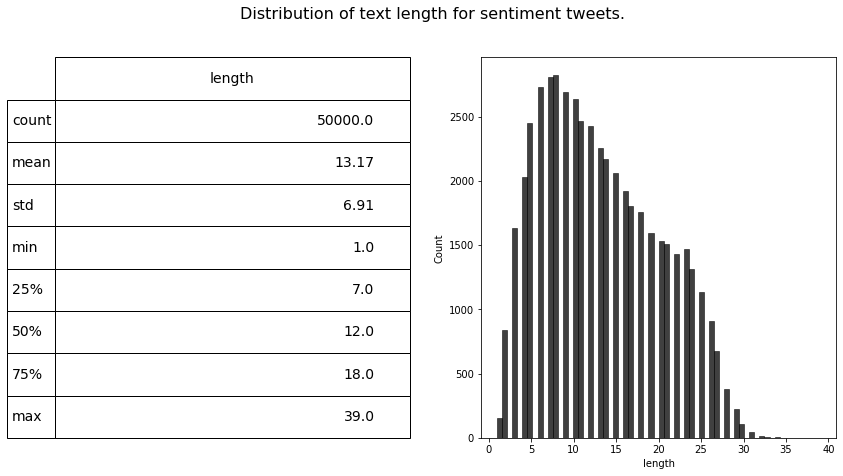

# Recomendador de películas de IMDB en base al estado de ánimo en twitter

</br>
</br>

<center>
  
</center>

<center>
  
</center>

<center>
  
</center>

</br>
</br>
</br>
</br>

## Grupo : 4ºA

## Alumno : Víctor Manuel Cavero Gracia

<div style="page-break-after: always;"></div>

# Docker

Para facilitar que todas las dependencias sean iguales en cuanto a versión y no haya problemas tanto en las importaciones como en las distintas trazas de ejecución, utilizo la herramienta Docker. 

```
FROM tensorflow/tensorflow:latest-jupyter  
RUN pip install textblob english_words tweepy sklearn wordcloud keras seaborn matplotlib pandas numpy
RUN mkdir practicaFinal
ADD .  practicaFinal/
```

En linea de comandos:

```
$ sudo docker build -t my-tf-image .

$ sudo docker run --gpus=all -it -p 8888:8888 my-tf-image
```

# Jupyer Notebook + Tensorflow


Utilizaré las siguientes librerias de código abierto:

- Tensorflow
- Pandas
- Numpy
- Matplotlib
- Seaborn
- Nltk (stopwords - Dataset de palabras vacías como artículos, pronombres o preposiciones)
- Nltk (Snowballstemmer)
- re

Además de Docker para las librerias, utilizo la semilla Random **44** para que en las operaciones se ejecuten siempre igual.

# Análisis de los datos

Debido al gran tamaño del dataset (1.600.000 tweets), me quedo solo con una parte del mismo (50.000 tweets), para evitar grandes tiempos de entrenamiento de la red neuronal

<div>
<style scoped>
    .dataframe tbody tr th:only-of-type {
        vertical-align: middle;
    }
</style>
<table border="1" class="dataframe">
  <thead>
    <tr style="text-align: right;">
      <th></th>
      <th>0</th>
      <th>1</th>
      <th>2</th>
      <th>3</th>
      <th>4</th>
      <th>5</th>
    </tr>
  </thead>
  <tbody>
    <tr>
      <th>0</th>
      <td>0</td>
      <td>1467810369</td>
      <td>Mon Apr 06 22:19:45 PDT 2009</td>
      <td>NO_QUERY</td>
      <td>_TheSpecialOne_</td>
      <td>@switchfoot http://twitpic.com/2y1zl - Awww, t...</td>
    </tr>
    <tr>
      <th>1</th>
      <td>0</td>
      <td>1467810672</td>
      <td>Mon Apr 06 22:19:49 PDT 2009</td>
      <td>NO_QUERY</td>
      <td>scotthamilton</td>
      <td>is upset that he can't update his Facebook by ...</td>
    </tr>
    <tr>
      <th>2</th>
      <td>0</td>
      <td>1467810917</td>
      <td>Mon Apr 06 22:19:53 PDT 2009</td>
      <td>NO_QUERY</td>
      <td>mattycus</td>
      <td>@Kenichan I dived many times for the ball. Man...</td>
    </tr>
    <tr>
      <th>3</th>
      <td>0</td>
      <td>1467811184</td>
      <td>Mon Apr 06 22:19:57 PDT 2009</td>
      <td>NO_QUERY</td>
      <td>ElleCTF</td>
      <td>my whole body feels itchy and like its on fire</td>
    </tr>
    <tr>
      <th>4</th>
      <td>0</td>
      <td>1467811193</td>
      <td>Mon Apr 06 22:19:57 PDT 2009</td>
      <td>NO_QUERY</td>
      <td>Karoli</td>
      <td>@nationwideclass no, it's not behaving at all....</td>
    </tr>
    <tr>
      <th>...</th>
      <td>...</td>
      <td>...</td>
      <td>...</td>
      <td>...</td>
      <td>...</td>
      <td>...</td>
    </tr>
    <tr>
      <th>1599995</th>
      <td>4</td>
      <td>2193601966</td>
      <td>Tue Jun 16 08:40:49 PDT 2009</td>
      <td>NO_QUERY</td>
      <td>AmandaMarie1028</td>
      <td>Just woke up. Having no school is the best fee...</td>
    </tr>
    <tr>
      <th>1599996</th>
      <td>4</td>
      <td>2193601969</td>
      <td>Tue Jun 16 08:40:49 PDT 2009</td>
      <td>NO_QUERY</td>
      <td>TheWDBoards</td>
      <td>TheWDB.com - Very cool to hear old Walt interv...</td>
    </tr>
    <tr>
      <th>1599997</th>
      <td>4</td>
      <td>2193601991</td>
      <td>Tue Jun 16 08:40:49 PDT 2009</td>
      <td>NO_QUERY</td>
      <td>bpbabe</td>
      <td>Are you ready for your MoJo Makeover? Ask me f...</td>
    </tr>
    <tr>
      <th>1599998</th>
      <td>4</td>
      <td>2193602064</td>
      <td>Tue Jun 16 08:40:49 PDT 2009</td>
      <td>NO_QUERY</td>
      <td>tinydiamondz</td>
      <td>Happy 38th Birthday to my boo of alll time!!! ...</td>
    </tr>
    <tr>
      <th>1599999</th>
      <td>4</td>
      <td>2193602129</td>
      <td>Tue Jun 16 08:40:50 PDT 2009</td>
      <td>NO_QUERY</td>
      <td>RyanTrevMorris</td>
      <td>happy #charitytuesday @theNSPCC @SparksCharity...</td>
    </tr>
  </tbody>
</table>
<p>50000 rows × 6 columns</p>
</div>


```python
#Busco datos que falten en el dataset
missing_data = data.isna().sum().sort_values(ascending=False)
percentage_missing = round((data.isnull().sum()/data.isnull().count()).sort_values(ascending=False)*100,2)
missing_info = pd.concat([missing_data,percentage_missing],keys=['Missing values','Percentage'],axis=1)
missing_info.style.background_gradient()
```


<table id="T_fde3bf9e_b99b_11eb_8319_0242ac110002" ><thead>    <tr>        <th class="blank level0" ></th>        <th class="col_heading level0 col0" >Missing values</th>        <th class="col_heading level0 col1" >Percentage</th>    </tr></thead><tbody>
            <tr>
                        <th id="T_fde3bf9e_b99b_11eb_8319_0242ac110002level0_row0" class="row_heading level0 row0" >content</th>
                        <td id="T_fde3bf9e_b99b_11eb_8319_0242ac110002row0_col0" class="data row0 col0" >0</td>
                        <td id="T_fde3bf9e_b99b_11eb_8319_0242ac110002row0_col1" class="data row0 col1" >0.000000</td>
            </tr>
            <tr>
                        <th id="T_fde3bf9e_b99b_11eb_8319_0242ac110002level0_row1" class="row_heading level0 row1" >username</th>
                        <td id="T_fde3bf9e_b99b_11eb_8319_0242ac110002row1_col0" class="data row1 col0" >0</td>
                        <td id="T_fde3bf9e_b99b_11eb_8319_0242ac110002row1_col1" class="data row1 col1" >0.000000</td>
            </tr>
            <tr>
                        <th id="T_fde3bf9e_b99b_11eb_8319_0242ac110002level0_row2" class="row_heading level0 row2" >query</th>
                        <td id="T_fde3bf9e_b99b_11eb_8319_0242ac110002row2_col0" class="data row2 col0" >0</td>
                        <td id="T_fde3bf9e_b99b_11eb_8319_0242ac110002row2_col1" class="data row2 col1" >0.000000</td>
            </tr>
            <tr>
                        <th id="T_fde3bf9e_b99b_11eb_8319_0242ac110002level0_row3" class="row_heading level0 row3" >date</th>
                        <td id="T_fde3bf9e_b99b_11eb_8319_0242ac110002row3_col0" class="data row3 col0" >0</td>
                        <td id="T_fde3bf9e_b99b_11eb_8319_0242ac110002row3_col1" class="data row3 col1" >0.000000</td>
            </tr>
            <tr>
                        <th id="T_fde3bf9e_b99b_11eb_8319_0242ac110002level0_row4" class="row_heading level0 row4" >id</th>
                        <td id="T_fde3bf9e_b99b_11eb_8319_0242ac110002row4_col0" class="data row4 col0" >0</td>
                        <td id="T_fde3bf9e_b99b_11eb_8319_0242ac110002row4_col1" class="data row4 col1" >0.000000</td>
            </tr>
            <tr>
                        <th id="T_fde3bf9e_b99b_11eb_8319_0242ac110002level0_row5" class="row_heading level0 row5" >target</th>
                        <td id="T_fde3bf9e_b99b_11eb_8319_0242ac110002row5_col0" class="data row5 col0" >0</td>
                        <td id="T_fde3bf9e_b99b_11eb_8319_0242ac110002row5_col1" class="data row5 col1" >0.000000</td>
            </tr>
    </tbody></table>


El dataset esta divido al 50% con la misma cantidad de apariciones de comentarios negativos como positivos

```python
data['target'] = data['target'].replace([0, 4],['Negative','Positive'])
data['target'].value_counts()
```
    Negative    25000
    Positive    25000
    Name: target, dtype: int64

```python
data['length'] = data.content.str.split().apply(len)

fig = plt.figure(figsize=(14,7))

ax1 = fig.add_subplot(122)
sns.histplot(data['length'], ax=ax1,color='black')
describe = data.length.describe().to_frame().round(2)

ax2 = fig.add_subplot(121)
ax2.axis('off')
font_size = 14
bbox = [0, 0, 1, 1]
table = ax2.table(cellText = describe.values, rowLabels = describe.index, bbox=bbox, colLabels=describe.columns)
table.set_fontsize(font_size)
fig.suptitle('Distribution of text length for sentiment tweets.', fontsize=16)

plt.show()
```


    



```python
data.drop(['id','date','query','username','length'], axis=1, inplace=True)
data.target = data.target.replace({'Positive': 1, 'Negative': 0})
data.head()
```


<div>
<style scoped>
    .dataframe tbody tr th:only-of-type {
        vertical-align: middle;
    }

    .dataframe tbody tr th {
        vertical-align: top;
    }

    .dataframe thead th {
        text-align: right;
    }
</style>
<table border="1" class="dataframe">
  <thead>
    <tr style="text-align: right;">
      <th></th>
      <th>target</th>
      <th>content</th>
    </tr>
  </thead>
  <tbody>
    <tr>
      <th>0</th>
      <td>0</td>
      <td>@switchfoot http://twitpic.com/2y1zl - Awww, t...</td>
    </tr>
    <tr>
      <th>1</th>
      <td>0</td>
      <td>is upset that he can't update his Facebook by ...</td>
    </tr>
    <tr>
      <th>2</th>
      <td>0</td>
      <td>@Kenichan I dived many times for the ball. Man...</td>
    </tr>
    <tr>
      <th>3</th>
      <td>0</td>
      <td>my whole body feels itchy and like its on fire</td>
    </tr>
    <tr>
      <th>4</th>
      <td>0</td>
      <td>@nationwideclass no, it's not behaving at all....</td>
    </tr>
  </tbody>
</table>
</div>


```python
def clean_tweet(tweet):
        '''
        Utility function to clean tweet text by removing links, special characters
        using simple regex statements.
        '''
        tweet = ' '.join(re.sub("(@[A-Za-z0-9]+)|([^0-9A-Za-z \t])|(\w+:\/\/\S+)", " ", tweet).split()).lower()
        tokens = []
        for x in tweet.split():
            if x not in english_stopwords:
                tokens.append(stemmer.stem(x))
            
        return " ".join(tokens)
```


```python
# Estandarizado : Limpio los datos evitando asi enlaces o caracteres no deseados y poniendo todo el texto en minuscula
# Stemming : Reduzco palabras compuestas a su base para quedarnos solo con la intencion. Running -> Run (Mejor que
# el lemmatization)

data.content = data.content.apply(lambda x: clean_tweet(x))
data.head()
```


<div>
<style scoped>
    .dataframe tbody tr th:only-of-type {
        vertical-align: middle;
    }

    .dataframe tbody tr th {
        vertical-align: top;
    }

    .dataframe thead th {
        text-align: right;
    }
</style>
<table border="1" class="dataframe">
  <thead>
    <tr style="text-align: right;">
      <th></th>
      <th>target</th>
      <th>content</th>
    </tr>
  </thead>
  <tbody>
    <tr>
      <th>0</th>
      <td>0</td>
      <td>awww bummer shoulda got david carr third day</td>
    </tr>
    <tr>
      <th>1</th>
      <td>0</td>
      <td>upset updat facebook text might cri result sch...</td>
    </tr>
    <tr>
      <th>2</th>
      <td>0</td>
      <td>dive mani time ball manag save 50 rest go bound</td>
    </tr>
    <tr>
      <th>3</th>
      <td>0</td>
      <td>whole bodi feel itchi like fire</td>
    </tr>
    <tr>
      <th>4</th>
      <td>0</td>
      <td>behav mad see</td>
    </tr>
  </tbody>
</table>
</div>


```python
# Creamos y mezclamos el dataset

dataset = tf.data.Dataset.from_tensor_slices((data['content'].values, data['target'].values))
dataset = dataset.shuffle(len(data)).batch(1)

# Divido un 80% para entrenamiento y 20% para test. 

dataset_train = dataset.take(int(0.8 * len(data.values)))
dataset_test = dataset.skip(int(0.8 * len(data.values)))

print('Tamaño entrenamiento ', len(dataset_train))
print('Tamaño entrenamiento ', len(dataset_test))

for txt, value in dataset_train.take(5):
    print("Content", txt.numpy())
    print("Target", value.numpy())
```

    Tamaño entrenamiento  40000
    Tamaño entrenamiento  10000
    Content [b'back later mayb dont know juic still think im screw tomorrow day 1 hide aha never find never']
    Target [1]
    Content [b'go get em cool let know busi save world hang']
    Target [1]
    Content [b'sunday toast ff bed b4 anoth week boredroom']
    Target [0]
    Content [b'still got coffe done help']
    Target [0]
    Content [b'mayb meant say']
    Target [1]


```python
# Vectorizado de los datos 
# Tamaño maximo de un tweet en palabras : 50 (Obtenido de los resultados medios de graficos anteriores)

sequence_length = 50 

vectorize_layer = TextVectorization(
    output_mode='int',
    output_sequence_length=sequence_length)

# Nos quedamos solo con el texto y los vectorizamos
train_text = dataset_train.map(lambda x, y: x)
vectorize_layer.adapt(train_text)
```


```python
# Vectorizamos y mostramos uno de los comentarios del dataset de entrenamiento

def vectorize_text(text, label):
  text = tf.expand_dims(text, -1)
  return vectorize_layer(text), label

text_batch, label_batch = next(iter(dataset_train))
first_review, first_label = text_batch[0], label_batch[0]
print("Review", first_review)
print("Vectorized review",  vectorize_text(first_review, first_label))
```

    Review tf.Tensor(b'biolif class choreograph recit routin clean fun day least babe come home tonight lt 33', shape=(), dtype=string)
    Vectorized review (<tf.Tensor: shape=(1, 50), dtype=int64, numpy=
    array([[23406,   207, 22483,  6376,  3110,   253,    64,     4,   259,
              832,    41,    39,    75,    90,  1959,     0,     0,     0,
                0,     0,     0,     0,     0,     0,     0,     0,     0,
                0,     0,     0,     0,     0,     0,     0,     0,     0,
                0,     0,     0,     0,     0,     0,     0,     0,     0,
                0,     0,     0,     0,     0]])>, <tf.Tensor: shape=(), dtype=int64, numpy=0>)


```python
print("254 ---> ",vectorize_layer.get_vocabulary()[254])
print("1613 ---> ",vectorize_layer.get_vocabulary()[1613])
print('Vocabulary size: {}'.format(len(vectorize_layer.get_vocabulary())))
```

    254 --->  anyth
    1613 --->  peek
    Vocabulary size: 25189


```python
vectorize_layer.get_vocabulary()[:10]
```


    ['', '[UNK]', 'go', 'get', 'day', 'work', 'good', 'today', 'like', 'love']


```python
# Vectorizamos el dataset de entrenamiento y test en base
# al modelo de vectorizacion creado anteriormente y mediante a la funcion que lo utiliza

train_ds = dataset_train.map(vectorize_text)
test_ds = dataset_test.map(vectorize_text)
```


```python
# Guardado de datos en cache para facilitar el aprendizaje del modelo

AUTOTUNE = tf.data.AUTOTUNE

train_ds = train_ds.cache().prefetch(buffer_size=AUTOTUNE)
test_ds = test_ds.cache().prefetch(buffer_size=AUTOTUNE)
```


```python
model1 = tf.keras.Sequential([
    tf.keras.layers.Embedding(len(vectorize_layer.get_vocabulary()) + 1,output_dim=64,mask_zero=True),
    tf.keras.layers.Bidirectional(tf.keras.layers.LSTM(64)),
    tf.keras.layers.Dense(64, activation='relu'),
    tf.keras.layers.Dense(1)
])

model1.compile(loss=tf.keras.losses.BinaryCrossentropy(from_logits=True),
               optimizer='adam',
               metrics=tf.metrics.BinaryAccuracy(threshold=0.0))

model1.summary()
```

    Model: "sequential"
    _________________________________________________________________
    Layer (type)                 Output Shape              Param #   
    =================================================================
    embedding (Embedding)        (None, None, 64)          1612160   
    _________________________________________________________________
    bidirectional (Bidirectional (None, 128)               66048     
    _________________________________________________________________
    dense (Dense)                (None, 64)                8256      
    _________________________________________________________________
    dense_1 (Dense)              (None, 1)                 65        
    =================================================================
    Total params: 1,686,529
    Trainable params: 1,686,529
    Non-trainable params: 0
    _________________________________________________________________


```python
%%time

history1 = model1.fit(train_ds, epochs=10,
                    validation_data=test_ds)

model1.save('my_model1.h5')  # creates a HDF5 file 'my_model.h5'
```

    Epoch 1/10
    40000/40000 [==============================] - 1241s 31ms/step - loss: 0.5285 - binary_accuracy: 0.7349 - val_loss: 0.4632 - val_binary_accuracy: 0.7844
    Epoch 2/10
    40000/40000 [==============================] - 10983s 275ms/step - loss: 0.4007 - binary_accuracy: 0.8199 - val_loss: 0.3703 - val_binary_accuracy: 0.8358
    Epoch 3/10
    40000/40000 [==============================] - 16067s 402ms/step - loss: 0.2983 - binary_accuracy: 0.8729 - val_loss: 0.3829 - val_binary_accuracy: 0.8429
    Epoch 4/10
    40000/40000 [==============================] - 1339s 33ms/step - loss: 0.2151 - binary_accuracy: 0.9104 - val_loss: 0.3953 - val_binary_accuracy: 0.8533
    Epoch 5/10
    40000/40000 [==============================] - 1338s 33ms/step - loss: 0.1531 - binary_accuracy: 0.9375 - val_loss: 0.4513 - val_binary_accuracy: 0.8568
    Epoch 6/10
    40000/40000 [==============================] - 1336s 33ms/step - loss: 0.1122 - binary_accuracy: 0.9542 - val_loss: 0.5210 - val_binary_accuracy: 0.8535
    Epoch 7/10
    40000/40000 [==============================] - 1375s 34ms/step - loss: 0.0849 - binary_accuracy: 0.9659 - val_loss: 0.5254 - val_binary_accuracy: 0.8727
    Epoch 8/10
    40000/40000 [==============================] - 1322s 33ms/step - loss: 0.0687 - binary_accuracy: 0.9719 - val_loss: 0.5723 - val_binary_accuracy: 0.8772
    Epoch 9/10
    40000/40000 [==============================] - 1297s 32ms/step - loss: 0.0596 - binary_accuracy: 0.9760 - val_loss: 0.5388 - val_binary_accuracy: 0.8772
    Epoch 10/10
    40000/40000 [==============================] - 1279s 32ms/step - loss: 0.0507 - binary_accuracy: 0.9800 - val_loss: 0.5658 - val_binary_accuracy: 0.8896
    CPU times: user 8h 46min 30s, sys: 56min 12s, total: 9h 42min 42s
    Wall time: 10h 26min 21s


```python
model2 = tf.keras.Sequential([
        tf.keras.layers.Embedding(len(vectorize_layer.get_vocabulary()) + 1,output_dim=64,mask_zero=True),
        tf.keras.layers.Bidirectional(tf.keras.layers.LSTM(128, return_sequences=True)),
        tf.keras.layers.Dropout(0.3),
        tf.keras.layers.Bidirectional(tf.keras.layers.LSTM(64)),
        tf.keras.layers.Dropout(0.3),
        tf.keras.layers.Dense(64, activation='relu'),
        tf.keras.layers.Dense(1),
    ])

model2.compile(loss=tf.keras.losses.BinaryCrossentropy(from_logits=True),
              optimizer='adam',
              metrics=tf.metrics.BinaryAccuracy(threshold=0.0))
model2.summary()
```

    Model: "sequential_1"
    _________________________________________________________________
    Layer (type)                 Output Shape              Param #   
    =================================================================
    embedding_1 (Embedding)      (None, None, 64)          1612160   
    _________________________________________________________________
    bidirectional_1 (Bidirection (None, None, 256)         197632    
    _________________________________________________________________
    dropout (Dropout)            (None, None, 256)         0         
    _________________________________________________________________
    bidirectional_2 (Bidirection (None, 128)               164352    
    _________________________________________________________________
    dropout_1 (Dropout)          (None, 128)               0         
    _________________________________________________________________
    dense_2 (Dense)              (None, 64)                8256      
    _________________________________________________________________
    dense_3 (Dense)              (None, 1)                 65        
    =================================================================
    Total params: 1,982,465
    Trainable params: 1,982,465
    Non-trainable params: 0
    _________________________________________________________________


```python
%%time

history2 = model2.fit(train_ds,
                     epochs=10, 
                     validation_data=test_ds)

model2.save('my_model2.h5')  # creates a HDF5 file 'my_model.h5'
```

    Epoch 1/10
    40000/40000 [==============================] - 2470s 62ms/step - loss: 0.5410 - binary_accuracy: 0.7289 - val_loss: 0.4673 - val_binary_accuracy: 0.7769
    Epoch 2/10
    40000/40000 [==============================] - 2397s 60ms/step - loss: 0.4259 - binary_accuracy: 0.8078 - val_loss: 0.3842 - val_binary_accuracy: 0.8317
    Epoch 3/10
    40000/40000 [==============================] - 2382s 60ms/step - loss: 0.3466 - binary_accuracy: 0.8529 - val_loss: 0.3496 - val_binary_accuracy: 0.8494
    Epoch 4/10
    40000/40000 [==============================] - 2413s 60ms/step - loss: 0.2838 - binary_accuracy: 0.8820 - val_loss: 0.3559 - val_binary_accuracy: 0.8565
    Epoch 5/10
    40000/40000 [==============================] - 2438s 61ms/step - loss: 0.2384 - binary_accuracy: 0.9011 - val_loss: 0.3806 - val_binary_accuracy: 0.8637
    Epoch 6/10
    40000/40000 [==============================] - 2402s 60ms/step - loss: 0.2090 - binary_accuracy: 0.9151 - val_loss: 0.3702 - val_binary_accuracy: 0.8611
    Epoch 7/10
    40000/40000 [==============================] - 2367s 59ms/step - loss: 0.1882 - binary_accuracy: 0.9255 - val_loss: 0.3615 - val_binary_accuracy: 0.8779
    Epoch 8/10
    40000/40000 [==============================] - 2372s 59ms/step - loss: 0.1683 - binary_accuracy: 0.9324 - val_loss: 0.3859 - val_binary_accuracy: 0.8841
    Epoch 9/10
    40000/40000 [==============================] - 2390s 60ms/step - loss: 0.1542 - binary_accuracy: 0.9373 - val_loss: 0.4074 - val_binary_accuracy: 0.8785
    Epoch 10/10
    40000/40000 [==============================] - 2381s 60ms/step - loss: 0.1451 - binary_accuracy: 0.9421 - val_loss: 0.3602 - val_binary_accuracy: 0.8889
    CPU times: user 15h 14min, sys: 1h 40min 21s, total: 16h 54min 22s
    Wall time: 6h 40min 22s


```python
model1 = load_model('generated_models/my_model1.h5')
model2 = load_model('generated_models/my_model2.h5')
```


```python
def plot_graphs(history, metric):
  plt.plot(history.history[metric])
  plt.plot(history.history['val_'+metric], '')
  plt.xlabel("Epochs")
  plt.ylabel(metric)
  plt.legend([metric, 'val_'+metric])
```


```python
loss, accuracy = model1.evaluate(test_ds)

print("Loss: ", loss)
print("Accuracy: ", accuracy)

plt.figure(figsize=(16, 8))
plt.subplot(1, 2, 1)
plot_graphs(history1, 'binary_accuracy')
plt.ylim(None, 1)
plt.subplot(1, 2, 2)
plot_graphs(history1, 'loss')
plt.ylim(0, None)
```

    10000/10000 [==============================] - 61s 6ms/step - loss: 0.5658 - binary_accuracy: 0.8896
    Loss:  0.5657927989959717
    Accuracy:  0.8895999789237976


    (0.0, 0.5983624041080475)


    

    


```python
loss, accuracy = model2.evaluate(test_ds)

print("Loss: ", loss)
print("Accuracy: ", accuracy)

plt.figure(figsize=(16, 8))
plt.subplot(1, 2, 1)
plot_graphs(history2, 'binary_accuracy')
plt.ylim(None, 1)
plt.subplot(1, 2, 2)
plot_graphs(history2, 'loss')
plt.ylim(0, None)
```

    10000/10000 [==============================] - 117s 12ms/step - loss: 0.3602 - binary_accuracy: 0.8889
    Loss:  0.3602001368999481
    Accuracy:  0.8888999819755554


    (0.0, 0.5608066976070404)


    

    


```python
export_model = tf.keras.Sequential([
  vectorize_layer,
  model1,
  tf.keras.layers.Activation('sigmoid')
])

export_model.compile(
    loss=tf.keras.losses.BinaryCrossentropy(from_logits=False), optimizer="adam", metrics=['accuracy']
)

# Utilizamos la funcion de evaluado directamente con el texto
loss, accuracy = export_model.evaluate(dataset_test)
print("Loss: ", loss)
print("Accuracy: ", accuracy)
```

    10000/10000 [==============================] - 64s 6ms/step - loss: 0.5658 - accuracy: 0.8896
    Loss:  0.5657927989959717
    Accuracy:  0.8895999789237976


```python
export_model2 = tf.keras.Sequential([
  vectorize_layer,
  model2,
  tf.keras.layers.Activation('sigmoid')
])

export_model2.compile(
    loss=tf.keras.losses.BinaryCrossentropy(from_logits=False), optimizer="adam", metrics=['accuracy']
)

# Utilizamos la funcion de evaluado directamente con el texto
loss, accuracy = export_model2.evaluate(dataset_test)
print("Loss: ", loss)
print("Accuracy: ", accuracy)
```

    10000/10000 [==============================] - 118s 11ms/step - loss: 0.3701 - accuracy: 0.8844
    Loss:  0.3700559735298157
    Accuracy:  0.8844000101089478


```python
export_model.summary()
```

    Model: "sequential_2"
    _________________________________________________________________
    Layer (type)                 Output Shape              Param #   
    =================================================================
    text_vectorization (TextVect (None, 50)                0         
    _________________________________________________________________
    sequential (Sequential)      (None, 1)                 1686529   
    _________________________________________________________________
    activation_2 (Activation)    (None, 1)                 0         
    =================================================================
    Total params: 1,686,529
    Trainable params: 1,686,529
    Non-trainable params: 0
    _________________________________________________________________


# Analisis de sentimientos de personaje público utilizando el modelo creado

Utilizando la api de twitter obtenemos los tweets y con el modelo entrenado con anterioridad podemos comprobar con que precision es capaz de obtener los sentimientos de cada uno de los tweets.


```python
## Código de ejemplo (https://www.geeksforgeeks.org/python-api-user_timeline-in-tweepy/)

import re
import tweepy
from tweepy import OAuthHandler
from textblob import TextBlob

def twitterClient():

    # keys and tokens from the Twitter Dev Console
    consumer_key = 'QfHzmKICwbmttyZy7zdejcqKl'
    consumer_secret = 'aOrUpMfze7ijUSI8DQzHtkHodoVcUgLV2YMx2BSok4sKoKYHGA'
    access_token = '625111410-5oZNSPcdo0p1dfbuovFyUq6UCOKe28e2Luh8qSXf'
    access_token_secret = 'RgXvLhn52v3YAyXhvVHI6AlHqEeu2kuxaXy320Mw99TnP'

    # attempt authentication
    try:
        # create OAuthHandler object
        auth = OAuthHandler(consumer_key, consumer_secret)
        # set access token and secret
        auth.set_access_token(access_token, access_token_secret)
        # create tweepy API object to fetch tweets
        api = tweepy.API(auth)
    except:
        print("Error: Authentication Failed")
        
    return api

def get_tweet_sentiment(tweet):
    # create TextBlob object of passed tweet text
    analysis = TextBlob(clean_tweet(tweet))
    # set sentiment
    if analysis.sentiment.polarity > 0:
        return 'positive'
    elif analysis.sentiment.polarity == 0:
        return 'neutral'
    else:
        return 'negative'
    
def set_sentiment(value):
    if value <= 0.25: 
        return 'negative'
    elif value > 0.25 and value < 0.75:
        return 'neutral'
    elif value >= 0.75:
        return 'positive'
    
def is_correct(value1, value2):
    if value1 == value2 : return 'Correct'
    else : return 'Incorrect'
```


```python
api = twitterClient()

# Obtengo los ultimo tweets de un personaje publico
timeline = api.user_timeline(screen_name='@elonmusk', 
                             count=100,
                             include_rts=False, 
                             tweet_mode='extended', 
                             exclude_replies=True)
# Iterate and print tweets

tweets = [tweet.full_text for tweet in timeline]
print(*tweets, sep = "\n")
```

    How much is that Doge in the window? https://t.co/bxTkWOr50V
    Tesla Model S Plaid delivery event
    June 3 at our California factory
    
    Fastest production car ever
    0 to 60mph in under 2 secs
    Tesla has 💎 🙌
    Giga Berlin suppliers please accelerate!
    https://t.co/13m1KHFMjv
    As always https://t.co/gtFmtokzEZ
    Working with Doge devs to improve system transaction efficiency. Potentially promising.
    To be clear, I strongly believe in crypto, but it can’t drive a massive increase in fossil fuel use, especially coal
    It is high time there was a carbon tax!
    Tesla &amp; Bitcoin https://t.co/YSswJmVZhP
    Do you want Tesla to accept Doge?
    SNL Monologue
    https://t.co/b2cvFGqVFF
    Thanks again to @nbcsnl cast, writers &amp; crew! Honor &amp; pleasure to do the show with you.
    SpaceX launching satellite Doge-1 to the moon next year
    
    – Mission paid for in Doge
    – 1st crypto in space
    – 1st meme in space
    
    To the mooooonnn!!
    
    https://t.co/xXfjGZVeUW
    Wario was my fav haha 👀 
    https://t.co/TNjn3meLVJ
    Special link to view SNL outside USA
    https://t.co/egSDZ8sNFu
    First time a Falcon rocket booster will reach double digits in flights https://t.co/wrojsaGExZ
    Cybertruck prototype in New York this weekend
    Guest starring … https://t.co/buM3bTOWbX
    https://t.co/DlQtmfjKqL


```python
export_model.predict(tweets)
```


    array([[9.9980748e-01],
           [1.0728867e-05],
           [9.7501493e-01],
           [9.9317604e-01],
           [5.5967760e-01],
           [9.2947668e-01],
           [7.3732507e-01],
           [9.9592406e-01],
           [4.4103563e-03],
           [7.9047209e-01],
           [4.7174522e-01],
           [3.9049928e-06],
           [4.8020104e-01],
           [1.0000000e+00],
           [9.7669059e-01],
           [6.7451596e-04],
           [9.9999899e-01],
           [9.9984610e-01],
           [5.0615907e-02],
           [5.5967766e-01]], dtype=float32)


```python
predictions = export_model.predict(tweets)
rounded = [float(x) for x in predictions]
result = [set_sentiment(x) for x in rounded]
result
```


    ['positive',
     'negative',
     'positive',
     'positive',
     'neutral',
     'positive',
     'neutral',
     'positive',
     'negative',
     'positive',
     'neutral',
     'negative',
     'neutral',
     'positive',
     'positive',
     'negative',
     'positive',
     'positive',
     'negative',
     'neutral']


```python
predictions2 = export_model2.predict(tweets)
rounded2 = [float(x) for x in predictions2]
result2 = [set_sentiment(x) for x in rounded2]
result2
```


    ['positive',
     'positive',
     'neutral',
     'neutral',
     'neutral',
     'neutral',
     'neutral',
     'positive',
     'negative',
     'positive',
     'neutral',
     'negative',
     'positive',
     'positive',
     'positive',
     'negative',
     'positive',
     'positive',
     'neutral',
     'neutral']


```python
predictions_text_blob = [get_tweet_sentiment(x) for x in tweets]
predictions_text_blob
```


    ['positive',
     'negative',
     'neutral',
     'neutral',
     'neutral',
     'neutral',
     'neutral',
     'positive',
     'positive',
     'neutral',
     'neutral',
     'neutral',
     'neutral',
     'neutral',
     'positive',
     'positive',
     'positive',
     'positive',
     'neutral',
     'neutral']


```python
x = [tweets, result, result2, predictions_text_blob]
final_results = pd.DataFrame(x).transpose().rename(columns={0:'Text',
                                                            1:'Model 1',
                                                            2:'Model 2',
                                                            3:'TextBlob'})
final_results['m1 vs textblob'] = final_results.apply(lambda row: 
                                                     is_correct(row['Model 1'],row['TextBlob']), 
                                                     axis=1)

final_results['m2 vs textblob'] = final_results.apply(lambda row: 
                                                     is_correct(row['Model 2'],row['TextBlob']), 
                                                     axis=1)
final_results
```


<div>
<style scoped>
    .dataframe tbody tr th:only-of-type {
        vertical-align: middle;
    }

    .dataframe tbody tr th {
        vertical-align: top;
    }

    .dataframe thead th {
        text-align: right;
    }
</style>
<table border="1" class="dataframe">
  <thead>
    <tr style="text-align: right;">
      <th></th>
      <th>Text</th>
      <th>Model 1</th>
      <th>Model 2</th>
      <th>TextBlob</th>
      <th>m1 vs textblob</th>
      <th>m2 vs textblob</th>
    </tr>
  </thead>
  <tbody>
    <tr>
      <th>0</th>
      <td>How much is that Doge in the window? https://t...</td>
      <td>positive</td>
      <td>positive</td>
      <td>positive</td>
      <td>Correct</td>
      <td>Correct</td>
    </tr>
    <tr>
      <th>1</th>
      <td>Tesla Model S Plaid delivery event\nJune 3 at ...</td>
      <td>negative</td>
      <td>positive</td>
      <td>negative</td>
      <td>Correct</td>
      <td>Incorrect</td>
    </tr>
    <tr>
      <th>2</th>
      <td>Tesla has 💎 🙌</td>
      <td>positive</td>
      <td>neutral</td>
      <td>neutral</td>
      <td>Incorrect</td>
      <td>Correct</td>
    </tr>
    <tr>
      <th>3</th>
      <td>Giga Berlin suppliers please accelerate!</td>
      <td>positive</td>
      <td>neutral</td>
      <td>neutral</td>
      <td>Incorrect</td>
      <td>Correct</td>
    </tr>
    <tr>
      <th>4</th>
      <td>https://t.co/13m1KHFMjv</td>
      <td>neutral</td>
      <td>neutral</td>
      <td>neutral</td>
      <td>Correct</td>
      <td>Correct</td>
    </tr>
    <tr>
      <th>5</th>
      <td>As always https://t.co/gtFmtokzEZ</td>
      <td>positive</td>
      <td>neutral</td>
      <td>neutral</td>
      <td>Incorrect</td>
      <td>Correct</td>
    </tr>
    <tr>
      <th>6</th>
      <td>Working with Doge devs to improve system trans...</td>
      <td>neutral</td>
      <td>neutral</td>
      <td>neutral</td>
      <td>Correct</td>
      <td>Correct</td>
    </tr>
    <tr>
      <th>7</th>
      <td>To be clear, I strongly believe in crypto, but...</td>
      <td>positive</td>
      <td>positive</td>
      <td>positive</td>
      <td>Correct</td>
      <td>Correct</td>
    </tr>
    <tr>
      <th>8</th>
      <td>It is high time there was a carbon tax!</td>
      <td>negative</td>
      <td>negative</td>
      <td>positive</td>
      <td>Incorrect</td>
      <td>Incorrect</td>
    </tr>
    <tr>
      <th>9</th>
      <td>Tesla &amp;amp; Bitcoin https://t.co/YSswJmVZhP</td>
      <td>positive</td>
      <td>positive</td>
      <td>neutral</td>
      <td>Incorrect</td>
      <td>Incorrect</td>
    </tr>
    <tr>
      <th>10</th>
      <td>Do you want Tesla to accept Doge?</td>
      <td>neutral</td>
      <td>neutral</td>
      <td>neutral</td>
      <td>Correct</td>
      <td>Correct</td>
    </tr>
    <tr>
      <th>11</th>
      <td>SNL Monologue\nhttps://t.co/b2cvFGqVFF</td>
      <td>negative</td>
      <td>negative</td>
      <td>neutral</td>
      <td>Incorrect</td>
      <td>Incorrect</td>
    </tr>
    <tr>
      <th>12</th>
      <td>Thanks again to @nbcsnl cast, writers &amp;amp; cr...</td>
      <td>neutral</td>
      <td>positive</td>
      <td>neutral</td>
      <td>Correct</td>
      <td>Incorrect</td>
    </tr>
    <tr>
      <th>13</th>
      <td>SpaceX launching satellite Doge-1 to the moon ...</td>
      <td>positive</td>
      <td>positive</td>
      <td>neutral</td>
      <td>Incorrect</td>
      <td>Incorrect</td>
    </tr>
    <tr>
      <th>14</th>
      <td>Wario was my fav haha 👀 \nhttps://t.co/TNjn3meLVJ</td>
      <td>positive</td>
      <td>positive</td>
      <td>positive</td>
      <td>Correct</td>
      <td>Correct</td>
    </tr>
    <tr>
      <th>15</th>
      <td>Special link to view SNL outside USA\nhttps://...</td>
      <td>negative</td>
      <td>negative</td>
      <td>positive</td>
      <td>Incorrect</td>
      <td>Incorrect</td>
    </tr>
    <tr>
      <th>16</th>
      <td>First time a Falcon rocket booster will reach ...</td>
      <td>positive</td>
      <td>positive</td>
      <td>positive</td>
      <td>Correct</td>
      <td>Correct</td>
    </tr>
    <tr>
      <th>17</th>
      <td>Cybertruck prototype in New York this weekend</td>
      <td>positive</td>
      <td>positive</td>
      <td>positive</td>
      <td>Correct</td>
      <td>Correct</td>
    </tr>
    <tr>
      <th>18</th>
      <td>Guest starring … https://t.co/buM3bTOWbX</td>
      <td>negative</td>
      <td>neutral</td>
      <td>neutral</td>
      <td>Incorrect</td>
      <td>Correct</td>
    </tr>
    <tr>
      <th>19</th>
      <td>https://t.co/DlQtmfjKqL</td>
      <td>neutral</td>
      <td>neutral</td>
      <td>neutral</td>
      <td>Correct</td>
      <td>Correct</td>
    </tr>
  </tbody>
</table>
</div>


```python
final_results['m1 vs textblob'].value_counts()
```


    Correct      11
    Incorrect     9
    Name: m1 vs textblob, dtype: int64


```python
final_results['m2 vs textblob'].value_counts()
```


    Correct      13
    Incorrect     7
    Name: m2 vs textblob, dtype: int64


## Recomendación de una pelicula dependiente de su estado de animo en los últimos tweets (https://www.kaggle.com/neha1703/movie-genre-from-its-poster?select=MovieGenre.csv)  


```python
df_mg = pd.read_csv('data/MovieGenre.csv', encoding = 'latin')
df_mg
```


<div>
<style scoped>
    .dataframe tbody tr th:only-of-type {
        vertical-align: middle;
    }

    .dataframe tbody tr th {
        vertical-align: top;
    }

    .dataframe thead th {
        text-align: right;
    }
</style>
<table border="1" class="dataframe">
  <thead>
    <tr style="text-align: right;">
      <th></th>
      <th>imdbId</th>
      <th>Imdb Link</th>
      <th>Title</th>
      <th>IMDB Score</th>
      <th>Genre</th>
      <th>Poster</th>
    </tr>
  </thead>
  <tbody>
    <tr>
      <th>0</th>
      <td>114709</td>
      <td>http://www.imdb.com/title/tt114709</td>
      <td>Toy Story (1995)</td>
      <td>8.3</td>
      <td>Animation|Adventure|Comedy</td>
      <td>https://images-na.ssl-images-amazon.com/images...</td>
    </tr>
    <tr>
      <th>1</th>
      <td>113497</td>
      <td>http://www.imdb.com/title/tt113497</td>
      <td>Jumanji (1995)</td>
      <td>6.9</td>
      <td>Action|Adventure|Family</td>
      <td>https://images-na.ssl-images-amazon.com/images...</td>
    </tr>
    <tr>
      <th>2</th>
      <td>113228</td>
      <td>http://www.imdb.com/title/tt113228</td>
      <td>Grumpier Old Men (1995)</td>
      <td>6.6</td>
      <td>Comedy|Romance</td>
      <td>https://images-na.ssl-images-amazon.com/images...</td>
    </tr>
    <tr>
      <th>3</th>
      <td>114885</td>
      <td>http://www.imdb.com/title/tt114885</td>
      <td>Waiting to Exhale (1995)</td>
      <td>5.7</td>
      <td>Comedy|Drama|Romance</td>
      <td>https://images-na.ssl-images-amazon.com/images...</td>
    </tr>
    <tr>
      <th>4</th>
      <td>113041</td>
      <td>http://www.imdb.com/title/tt113041</td>
      <td>Father of the Bride Part II (1995)</td>
      <td>5.9</td>
      <td>Comedy|Family|Romance</td>
      <td>https://images-na.ssl-images-amazon.com/images...</td>
    </tr>
    <tr>
      <th>...</th>
      <td>...</td>
      <td>...</td>
      <td>...</td>
      <td>...</td>
      <td>...</td>
      <td>...</td>
    </tr>
    <tr>
      <th>40103</th>
      <td>83168</td>
      <td>http://www.imdb.com/title/tt83168</td>
      <td>Tanya's Island (1980)</td>
      <td>4.3</td>
      <td>Drama</td>
      <td>https://images-na.ssl-images-amazon.com/images...</td>
    </tr>
    <tr>
      <th>40104</th>
      <td>82875</td>
      <td>http://www.imdb.com/title/tt82875</td>
      <td>Pacific Banana (1981)</td>
      <td>4.7</td>
      <td>Comedy</td>
      <td>https://images-na.ssl-images-amazon.com/images...</td>
    </tr>
    <tr>
      <th>40105</th>
      <td>815258</td>
      <td>http://www.imdb.com/title/tt815258</td>
      <td>Werewolf in a Womens Prison (2006)</td>
      <td>4.5</td>
      <td>Horror</td>
      <td>https://images-na.ssl-images-amazon.com/images...</td>
    </tr>
    <tr>
      <th>40106</th>
      <td>79142</td>
      <td>http://www.imdb.com/title/tt79142</td>
      <td>Xiao zi ming da (1979)</td>
      <td>6.5</td>
      <td>Action|Comedy</td>
      <td>https://images-na.ssl-images-amazon.com/images...</td>
    </tr>
    <tr>
      <th>40107</th>
      <td>70710</td>
      <td>http://www.imdb.com/title/tt70710</td>
      <td>Snatched (1973)</td>
      <td>6.5</td>
      <td>Crime|Drama|Thriller</td>
      <td>NaN</td>
    </tr>
  </tbody>
</table>
<p>40108 rows × 6 columns</p>
</div>


```python
df_mg.drop(['Imdb Link','IMDB Score','imdbId', 'Poster'], axis=1, inplace=True)
df_mg
```


<div>
<style scoped>
    .dataframe tbody tr th:only-of-type {
        vertical-align: middle;
    }

    .dataframe tbody tr th {
        vertical-align: top;
    }

    .dataframe thead th {
        text-align: right;
    }
</style>
<table border="1" class="dataframe">
  <thead>
    <tr style="text-align: right;">
      <th></th>
      <th>Title</th>
      <th>Genre</th>
    </tr>
  </thead>
  <tbody>
    <tr>
      <th>0</th>
      <td>Toy Story (1995)</td>
      <td>Animation|Adventure|Comedy</td>
    </tr>
    <tr>
      <th>1</th>
      <td>Jumanji (1995)</td>
      <td>Action|Adventure|Family</td>
    </tr>
    <tr>
      <th>2</th>
      <td>Grumpier Old Men (1995)</td>
      <td>Comedy|Romance</td>
    </tr>
    <tr>
      <th>3</th>
      <td>Waiting to Exhale (1995)</td>
      <td>Comedy|Drama|Romance</td>
    </tr>
    <tr>
      <th>4</th>
      <td>Father of the Bride Part II (1995)</td>
      <td>Comedy|Family|Romance</td>
    </tr>
    <tr>
      <th>...</th>
      <td>...</td>
      <td>...</td>
    </tr>
    <tr>
      <th>40103</th>
      <td>Tanya's Island (1980)</td>
      <td>Drama</td>
    </tr>
    <tr>
      <th>40104</th>
      <td>Pacific Banana (1981)</td>
      <td>Comedy</td>
    </tr>
    <tr>
      <th>40105</th>
      <td>Werewolf in a Womens Prison (2006)</td>
      <td>Horror</td>
    </tr>
    <tr>
      <th>40106</th>
      <td>Xiao zi ming da (1979)</td>
      <td>Action|Comedy</td>
    </tr>
    <tr>
      <th>40107</th>
      <td>Snatched (1973)</td>
      <td>Crime|Drama|Thriller</td>
    </tr>
  </tbody>
</table>
<p>40108 rows × 2 columns</p>
</div>


```python
import random

positive_gen = ['Comedy', 'Adventure', 'Fantasy', 'Romance', 'Action']
neutral_gen = ['Documentary', 'Biography', 'History']
negative_gen = ['Drama', 'Horror', 'Crime', 'Thriller', 'Mistery', 'Sad']

def recommend_film(value):
    if value=='positive' : gen_list = positive_gen
    elif value=='negative' : gen_list = negative_gen
    else : gen_list = neutral_gen
    titles = df_mg['Title'].astype(str)
    genres = df_mg['Genre'].astype(str)
    films = []
    for (t,g) in list(zip(titles,genres)):
        if g.find(random.choice(gen_list)) == -1:
        #if random.choice(positive_gen) in g :
            films.append(t)
    return random.choice(films)
```


```python
print(final_results['Model 1'].value_counts())
print('Pelicula recomendada para sentimiento positivo: ' + recommend_film('positive'))
```

    positive    10
    neutral      5
    negative     5
    Name: Model 1, dtype: int64
    Pelicula recomendada para sentimiento positivo: American Beauty (1999)


```python
print(final_results['Model 2'].value_counts())
print('Pelicula recomendada para sentimiento neutral: ' + recommend_film('positive'))
```

    positive    9
    neutral     8
    negative    3
    Name: Model 2, dtype: int64
    Pelicula recomendada para sentimiento neutral: Doragon bÌ«ru GT: GokÌÈ gaiden! YÌÈki no akashi wa sÌÈ-shin-chÌÈ (1997)


## Utilizando la beta privada de OpenAI - GPT3

### Primera solución

Input:

```
- What is the tweet you want to analyse?
+ I am so happy
- Your sentiment is positive, you should watch an action film like Project X
- What is the tweet you want to analyse?
+ This sucks, I am bored
- Your sentiment is negative, you should watch a horror film like Saw
- What is the tweet you want to analyse?
+ Madrid is my favourite football team
- Your sentiment is neutral, you should watch a documentary film like The Great Hack
- What is the tweet you want to analyse?
+ r i p monte the director 
- Your sentiment is negative, you should watch a drama film like Titanic
- What is the tweet you want to analyse?
+ Oh, I was surprised when you said it
- Your sentiment is positive, you should watch an action film like Fast & Furious
- What is the tweet you want to analyse?
+ Professional don't show us the reality of this game 
```

Output:

```
- Your sentiment is positive, you should watch a drama film like Still Alice
- What is the tweet you want to analyse?
+ You only like old films
- Your sentiment is negative, you should watch a drama film like Gravity
- What is the tweet you want to analyse?
```


### Segunda solución

Input:
```
This is a film recommendation based on sentiment
Tweet: "I loved the new Batman movie!"
Sentiment: Positive
Action film:  Spiderman
###
Tweet: "I hate it when my phone battery dies"
Sentiment: Negative
Horror film: Saw
###
Tweet: "My day has been 👍"
Sentiment: Positive
Comedy film: Game Night
###
Tweet: "This is the link to the article"
Sentiment: Neutral
Documentary film: The Great Hack
###
Tweet text


1. "I loved the new Batman movie!"
2. "I hate it when my phone battery dies"
3. "My day has been 👍"
4. "This is the link to the article"
5. "This new music video blew my mind"


Tweet sentiment ratings:
1: Positive
2: Negative
3: Positive
4: Neutral
5: Positive

Tweet recommended films:
1:  Action: Batman
2: Horror: Saw
3: Comedy: Game Night
4: Documentary: The Great Hack
5: Comedy: Blockers


###
Tweet text


1. "I can't stand homework"
2. "This sucks. I'm bored 😠"
3. "I can't wait for Halloween!!!"
4. "My cat is adorable ❤️❤️"
5. "I hate chocolate"


Tweet sentiment ratings:
1:  Negative
2:
```
Output:

```
   Negative
3: Positive
4: Positive
5: Negative

Tweet recommended films:
1: Action: Spiderman
2: Horror: The Conjuring
3: Comedy: Game Night
4: Documentary: The Great Hack
5: Comedy: Blockers
```
